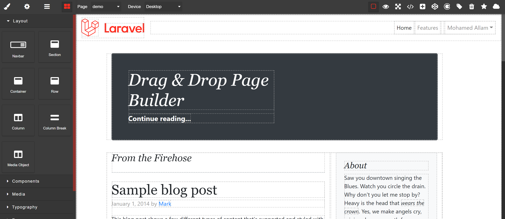
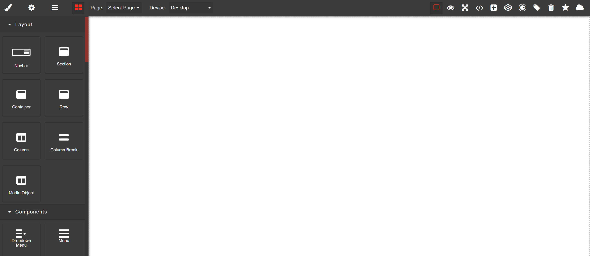
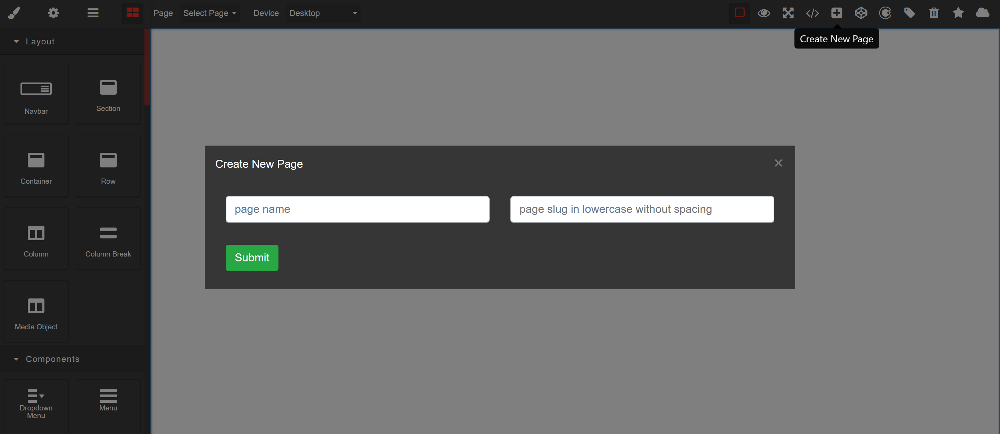

<p align="center"></p>
<p align="center">


</p>
<p align="left"></p>

## About Laravel Grapes

Laravel Grapes is a library for laravel framework, that offer cms drag and drop page builder for frontend which support all Laravel functionality and help user to change all frontend and content just in simple clicks.

Laravel Grapes Comes With A Pro Version Available On [Code Canyon](https://codecanyon.net/)

<hr>

### Installation Steps

```jsx 
composer require msa/laravel-grapes
```
```jsx 
php artisan vendor:publish --provider="MSA\LaravelGrapes\LaravelGrapesServiceProvider" --tag="*"
```

```jsx 
php artisan migrate
```


#### Go to config/lg.php

```jsx
    <?php

    return [
        // routes configurations
        'builder_prefix' => 'hello', // prefix for builder

        'middleware' => null, // middleware for builder

        'frontend_prefix' => '', // prefix for frontend
    ];`
```

##### 1) builder_prefix
The builder by default come with route [your-domain.com/hello/front-end-builder](#1-builder_prefix).<br>
you can change the builder prefix to hi so now the builder load with route prefix hi instead of hello.

##### 2) middleware
Assign any middleware you want to the builder for example auth:admin.

##### 3) frontend_prefix
The frontend prefix by default it comes empty that mean that any generated front end page builder it load directly with your slug that created by you so if you need to set prefix for your generated frontend so change it to your prefix that you want. <br>

Now laravel grapes is working.

Navigate to builder route [your-domain.com/builder_prefix/front-end-builder](#1-builder_prefix).

<p align="left"></p>

<hr>

### Customize Style

#### Go to public/css/laravel-grapes.css

Start Customizing Laravel Grapes Builder As You Wish.

<hr>

### How To Use Laravel Grapes Builder

##### 1) Create New Page

Press on plus button and fill page name and slug, if you need it a home page type slug /.

<p align="left"></p>
