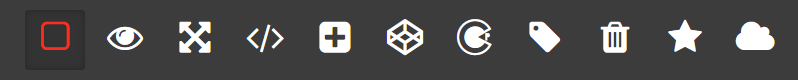
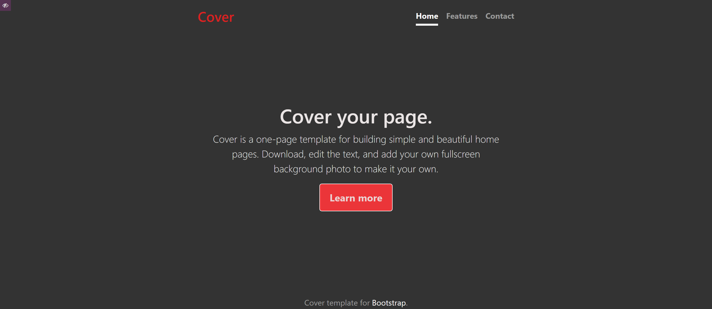
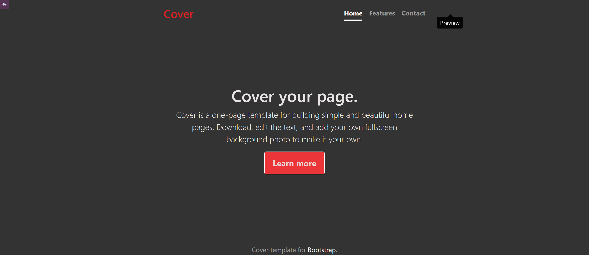
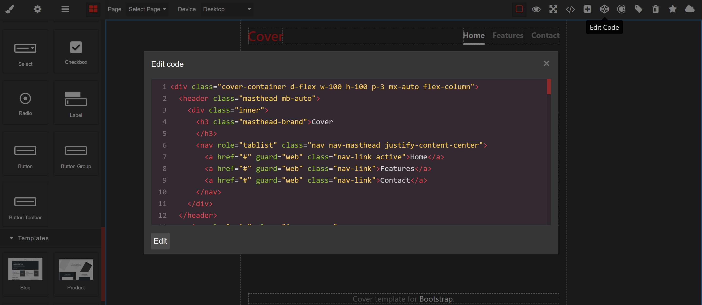
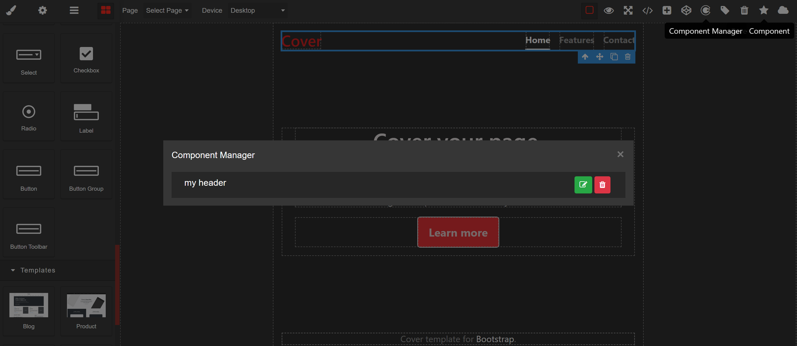

<p align="center"></p>
<p align="center">


</p>
<p align="left"></p>

## About Laravel Grapes

Laravel Grapes is a library for laravel framework, that offer cms drag and drop page builder for frontend which support all Laravel functionality and help user to change all frontend and content just in simple clicks.

Laravel Grapes Comes With A Pro Version Available On [Code Canyon](https://codecanyon.net/)

<hr>

## Installation Steps

```jsx 
composer require msa/laravel-grapes
```
```jsx 
php artisan vendor:publish --provider="MSA\LaravelGrapes\LaravelGrapesServiceProvider" --tag="*"
```

```jsx 
php artisan migrate
```


#### Go to config/lg.php

```jsx
    <?php

    return [
        // routes configurations
        'builder_prefix' => 'hello', // prefix for builder

        'middleware' => null, // middleware for builder

        'frontend_prefix' => '', // prefix for frontend
    ];`
```

##### 1) builder_prefix
The builder by default come with route [your-domain.com/hello/front-end-builder](#1-builder_prefix).<br>
you can change the builder prefix to hi so now the builder load with route prefix hi instead of hello.

##### 2) middleware
Assign any middleware you want to the builder for example auth:admin.

##### 3) frontend_prefix
The frontend prefix by default it comes empty that mean that any generated front end page builder it load directly with your slug that created by you so if you need to set prefix for your generated frontend so change it to your prefix that you want. <br>

Now laravel grapes is working.

Navigate to builder route [your-domain.com/builder_prefix/front-end-builder](#1-builder_prefix).

<p align="left"></p>

<hr>

### Customize Style

#### Go to public/css/laravel-grapes.css

Start Customizing Laravel Grapes Builder As You Wish.

<hr>

## How To Use

The Controll Panel Consists Of 3 Panels :-

1) Options Panel <br>

2) Page Panel <br>

3) View Panel <br>

#### 1. Options Panel
<p align="left"></p>

The options panel consists of 11 buttons :-

- [View Components](#view-components)
- [Preview](#preview)
- [Full Screen](#full-screen)
- [View Code](#view-code)
- [Create New Page](#create-new-page)
- [Edit Code](#edit-code)
- [Component Manager](#component-manager)
- [Page Manager](#page-manager)
- [Clear Canvas](#clear-canvas)
- [Save Component](#save-component)
- [Save Changes](#save-changes)

#### View Components
The view component button show grid lines for all components droped in the canvas, this help to to select each component individual for example take a look on the screenshot below.

<p align="left"></p>

#### Preview
The preview button help you to show page without pannels like screenshot below
<p align="left"></p>

#### Full Screen
The full screen mode button hide all browser utils and show only the builder.

#### View Code
The view code button show you the html and css code of the page like sceenshot below
<p align="left"></p>

#### Create New Page

The create new page button at topbar when you press on it, the popup modal open with new page form, so fill page name and slug and if you need the page become a home page type slug /  .

<p align="left"></p>

After submit the form will receive toast notification tha page creaded successfully, so select the new page throw select page input on the top bar to start modifying the page.

#### Edit Code
The edit code button it will open a popup code editor modal that hold page code including html and css.
<p align="left"></p>
So you can edit the html and css code from the code editor popup, for editing syles you will find page style inside tag <code><style></style></code>.<br>

###### Note: Html and css on the code editor merged in one page but after submit the code you can [View Code](#view-code), you will find styles and html each of them seperate and each generated page has it's own blade file and css file.


#### Component Manager
The Component Manager button will open a popup hold all custome components that has been [saved](#save-component) to reused on another page to let you edit name of the component or delete it.
<p align="left"></p>

#### Page Manager
The page manager button will open a popup hold all pages and let you to edit page name and slug.
<p align="left"></p>

#### Clear Canvas
The clear canvas button will remove all components from the canvas.

#### Save Component
Laravel Grapes let you to save any custome component for reuse it on another pages all you need to select the component and click on [Save Component Button](#save-component).

#### Save Changes
